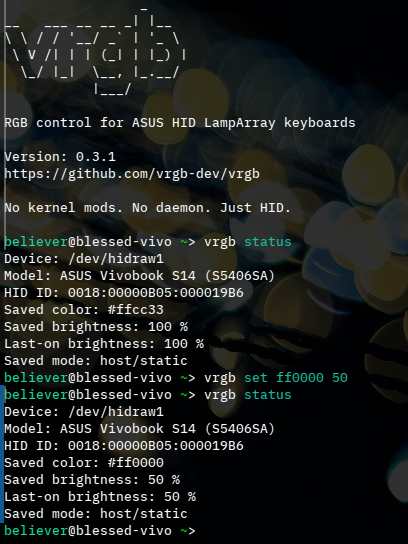

   
   
  RGB control for ASUS Vivobook HID LampArray keyboards on Linux 

## Overview

VRGB is a lightweight Linux CLI utility for controlling RGB keyboards on
Vivobook ASUS laptops that expose the HID LampArray interface.

**Why this exists:**

I bought a Vivobook S14 and put Fedora on it for school and work. Fn brightness worked, but the keyboard was stuck on white and none of the usual ASUS RGB tools did anything. After digging into it, I found the keyboard wasn’t using the typical ASUS control path at all.

VRGB is just a tool built around that discovery to get simple RGB control working on Linux without touching the kernel or running a daemon.

 

**The project was developed and validated on:**

ITE5570 (HID_ID: 0018:00000B05:000019B6)  
- ASUS Vivobook S14 (S5406SA-WH79)  
- firmware: 0x0B  
- color: 0x05  

**Community validated:**

ITE5570 (HID_ID: 0018:00000B05:00005570)  
- ASUS Vivobook S16 series (M5606K / M5606WA)  
- firmware: 0x46  
- color: 0x45  
- note: OEM rainbow may not function on all models  

 

Unlike some RGB tools, VRGB does not rely on kernel patches, vendor utilities, background daemons, controller hacks, or reverse-engineered Windows drivers. VRGB simply communicates with the keyboard controller through the Linux HID subsystem. 

 

**Control path:**

    vrgb.py
       ↓
    /dev/hidrawX
       ↓
    ITE5570 keyboard controller
       ↓
    RGB lighting

Current Stable Release: v.0.3.1
    

## Example Usage

  

## Features

-   Static RGB color control
-   Fine brightness scaling (0–100%)
-   Custom profiles
-   Firmware autonomous mode toggle
-   OEM rainbow toggle (sudo required)
-   Debug diagnostics
-   Persistent configuration
-   Installer and uninstaller included
-   Non-root daily usage via udev permissions
-   Optional KDE autostart restore

## Supported Hardware

VRGB supports ASUS laptops that expose the **ITE5570 HID LampArray controller**.

Support is based on **verified device mappings**, not specific laptop models.

### Verified mappings

**ITE5570 (HID_ID: 0018:00000B05:000019B6)**  
- confirmed on: ASUS Vivobook S14 (S5406SA)  
- firmware report: `0x0B`  
- color report: `0x05`

**ITE5570 (HID_ID: 0018:00000B05:00005570)**  
- confirmed on: ASUS Vivobook S16 series (M5606K / M5606WA)  
- firmware report: `0x46`  
- color report: `0x45`  
- note: OEM rainbow mode may not function on all models

### Example device identifiers

    HID_NAME=ITE5570:00 0B05:19B6
    HID_ID=0018:00000B05:000019B6

## Compatibility

VRGB scans available `hidraw` devices and selects compatible ASUS keyboard controllers automatically.

Multiple ASUS laptops appear to share the same ITE5570 controller and HID LampArray protocol. If your system exposes a similar device, there is a strong chance VRGB will work.

Support expands through **verified device mappings** as new hardware is tested. Stability and correctness are prioritized over broad but unreliable compatibility.

If VRGB works (or does not work) on your system, please submit a compatibility report including:

    vrgb --debug status

Community reports help identify new supported devices quickly.

See reports here:  
https://github.com/vrgb-dev/vrgb/issues/1

## Quick Install

Clone the repository and run the installer.

    git clone https://github.com/vrgb-dev/vrgb.git
    cd vrgb
    chmod +x install.sh
    ./install.sh

After installation log out and log back in so group permissions apply.

**Note:**
Keyboard color persists on reboot, but may reset to firmware default after a full power cycle.
Use the KDE autostart option in the installer (or set it manually) to reapply your configuration automatically.

## Command List

Show Current Status

    vrgb status

Set RGB Color

    vrgb set RRGGBB [brightness %]

*Example:*

    vrgb set 00aa55 65

Change Brightness

    vrgb brightness 80
    
Save Profile (Current State)

    vrgb profile save fedorablue
    
Load Profile

    vrgb profile load fedorablue
    
Delete Profile

    vrgb profile delete fedorablue
    
List Saved Profiles

    vrgb profile list

Turn Lighting Off

    vrgb off

Restore Saved State

    vrgb restore

Enable firmware lighting (Firmware Autonomous Mode)

    vrgb auto on

Return control to VRGB:

    vrgb auto off

OEM Rainbow Mode (requires sudo)

    sudo vrgb rainbow on
    sudo vrgb rainbow off

Debug Mode

    vrgb --debug status

About

    vrgb about

## Manual Installation

Install Binary

    sudo install -m 755 vrgb.py /usr/local/bin/vrgb

Create Access Group

    sudo groupadd -f vrgb
    sudo usermod -aG vrgb $USER

Install udev Rule

Create:

    /etc/udev/rules.d/99-vrgb.rules

Contents:

    SUBSYSTEM=="hidraw", KERNELS=="i2c-ITE5570*", MODE="0660", GROUP="vrgb"

Reload udev

    sudo udevadm control --reload-rules
    sudo udevadm trigger

Log out and log back in afterward.

## Optional KDE Autostart Restore

Create:

    ~/.config/autostart/vrgb.desktop

Contents:

    [Desktop Entry]
    Type=Application
    Exec=/usr/local/bin/vrgb restore
    Hidden=false
    NoDisplay=false
    X-GNOME-Autostart-enabled=true
    Name=VRGB Restore
    Comment=Restore keyboard RGB state

## Uninstall

    ./uninstall.sh

Removes:

-   /usr/local/bin/vrgb
-   the udev rule
-   optional autostart entry

## Future Development

- expanded ASUS hardware compatibility
- GUI frontend
- breathing / fade effects
- effect profiles

With future updates in mind, this project will aim to continue to be as efficient and lightweight as possible.

## Changelog

v0.3.1

- introduced multi-device support architecture
- replaced hardcoded HID targeting with device mappings
- added support for ITE5570 (0x5570) devices
- confirmed working on additional Vivobook S16 hardware (community tested)
- refactored device detection to return structured device info
- eliminated global report ID assumptions
- no behavioral changes for existing supported devices

v0.3

-    added named profile support
-    profile save/load/list/delete commands
-    profile data stored in config.json
-    profile load applies immediately to hardware
-    non-HID commands no longer require device detection

v0.2.2

-   improved CLI help output
-   installer/Uninstaller validation
-   confirmed non-root HID access
-   release packaging

v0.2.0

-   automatic hidraw detection
-   debug mode
-   persistent config
-   installer script

v0.1

Initial prototype with static RGB and brightness control.

## License

MIT License

## Repository

https://github.com/vrgb-dev/vrgb
